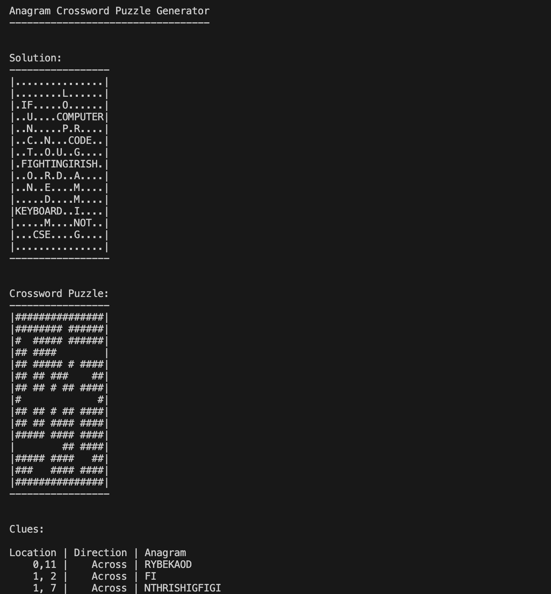

# Crossword

Created a program that generates a blank crossword puzzle, clues made of anagrams of the words, and a solution of the puzzle.

The program has different modes depending on the command line arguments:

No command line arguments: the user enters a list of words to place in the crossword

File name inputted as a command line argument: the program takes the list of words in the input file and creates the crossword using them

Main code file: crossword.c
